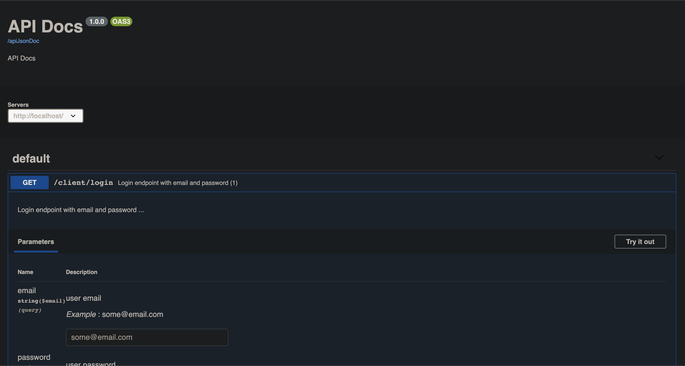

# Joi-Swagger

Rest API docs generator based on OPENAPI 3 and swagger-ui


## Installation

[](https://nodei.co/npm/joi-swagger/)


>npm install joi-swagger

## Example
```javascript

const joiSwagger = require("joi-swagger");
const joi = require("joi")

// routes examples
const routes[
  {
    path: "/client/login",
    method: "GET",
    summary: "Login endpoint with email and password",
    description: "Login endpoint with email and password ...",
    validations: {
      query: joi.object({
        email: joi.string().email().required().example("some@email.com").description("user email"),
        password: joi.string().required().example("0987654321").description("user password"),
      }),
      output: {
        200: joi.object({}),
      },
    },
  },
  {
    method: "GET",
    summary: "Items details endpoint",
    description: "Items details endpoint ...",
    path: "/items/{itemId}/details",
    validations: {
      path: joi.object({
        itemId: joi.string().required().example("2323423423234").description("this is items ID"),
      }),
    },
  },
  {
    method: "POST",
    summary: "update item in the database",
    description: "update items ops ...",
    path: "/items/{itemId}/details",
    validations: {
      body: joi.object({
        itemId: joi.string().required().example("2323423423234").description("this is items ID"),
      }),
    },
  },
  {
    method: "post",
    path: "/{id}",
    summary: "Update (4)",
    description: "update description",
    validations: {
      path: joi.object({ id: joi.string().description("user ID").example("qwlk2l3kenr2kalsknfldkns") }),
      body: joi.object({
        avatar: joi.string().required().uri(),
        icon: joi.string().meta({ contentMediaType: "image/png" }),
        email: joi
          .string()
          .example("someEmail@email.com")
          .email()
          .description("this user email")
          .error(new Error("wrong email")),
        height: joi.number().precision(2),
        skills: joi
          .array()
          .items(
            joi.alternatives(
              joi.string(),
              joi.object().keys({
                name: joi.string().example("teleport").alphanum().description("Skill Name").lowercase(),
                level: joi.number().integer().example(1).description("Skill Level"),
              }),
            ),
          )
          .min(1)
          .max(3)
          .unique()
          .description("Skills"),
        retired: joi.boolean().truthy("yes").falsy("no").sensitive(true),
        certificate: joi.binary().encoding("base64"),
      }),
    },
  },
  {
    method: "put",
    summary: "Update item price in the database ",
    description: "Update item price information",
    path: "/items/{itemId}/update",
    validations: {
      path: joi.object({
        itemId: joi.string().required().example("2323423423234").description("this is items ID"),
      }),
      body: joi.object({
        name: joi.string().required().example("Backing souda").description("Items name"),
        price: joi.number().required().example("15.00").description("Item price"),
        expiationDate: joi.date().required().example("12/12/2020").description("Item expiration date"),
      }),
    },
    responses: {
      200: {
        description: "Returned updated item",
        schema: Joi.object({
          name: joi
            .string()
            .required()
            .example("Backing souda")
            .description("Items name")
            .error(new Error("Wrong name")),
          price: joi.number().required().example("15.00").description("Item price"),
          expiationDate: joi.date().required().example("12/12/2020").description("Item expiration date"),
          company: joi.string().example("Foodify").description("Food company name"),
        }).description("Returned item after update"),
      },
      400: {
        description: "Some error",
        schema: Joi.string(),
      },
    },
  },
];

// lunch http server to serve API documentaions
const PORT = 8081
joiSwagger(routes,PORT)

```



## License
MIT